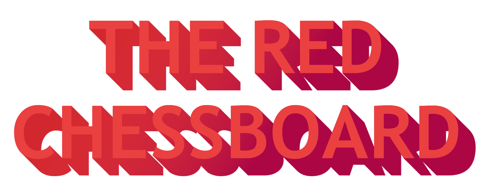
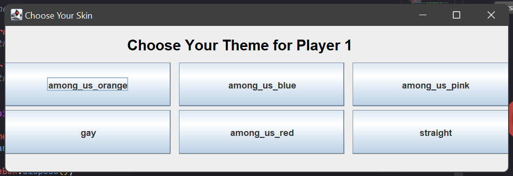
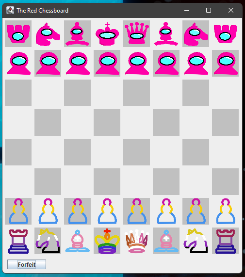
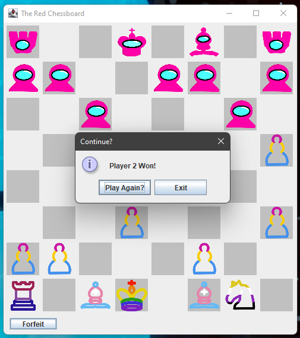

# The Red Chessboard

This game plays almost entirely like chess, except for one simple fact: The King is not who you are aiming to trap. You must take every piece from the opposing team. We recommend you watch [this](https://www.youtube.com/watch?v=9EokyOq3_ZQ) to see the gameplay.

# Choosing Your Theme

At initialization, players can choose their themes. Simply press the button corresponding to the theme you want for each player.

# Gameplay
## Basics
The gameplay is just like normal chess; the only difference is that you can kill the king!

The player on the bottom is first player. Simply click a piece, and make a valid move relative to that of chess. If you click on another one of your pieces instead, focus will simply move to that piece. 

## Forfeiting

If, *while on your turn*, you feel as though you cannot/will not win, simply press the forfeit button in the bottom left. This will allow the game to recognize that you give up, and give congrats to the winner. Press `Play Again` to reinvent the board, or `exit` to exit the software.